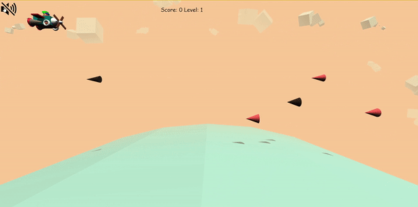

<h1 align=center>Đồ họa máy tính - CS105.M21</h1>
<h1 align=center>ĐỀ TÀI: Hyper Raider Game</h1>

## **GIỚI THIỆU MÔN HỌC**

* **Môn học:** Đồ họa máy tính
* **Giảng viên hướng dẫn:** TS. Mai Tiến Dũng
* **Lớp:** CS105.M21
* **Năm học:** 2021-2022

## **THÀNH VIÊN NHÓM**
| STT    | MSSV          | Họ và Tên           | Email                   |
| ------ |---------------| --------------------|-------------------------|
| 1      | 19521388      | Hoàng Tiến Dũng   |19521388@gm.uit.edu.vn   |
| 2      | 19522410   | Nguyễn Thành Trọng    |19522410@gm.uit.edu.vn   |

## **GIỚI THIỆU ĐỀ TÀI**
Từ trước đến giờ chúng ta đã khá quen thuộc với các game liên quan
đến máy bay, ví dụ: bắn gà, bắn máy bay,… Nhóm chúng tôi đã lấy ý tưởng
hình tượng từ các trò chơi đó kết hợp với ý tưởng từ game khủng long và game
sonic để xây dựng Hyper Raider Game.

## **DEMO**
**Link:** [Hyper Raider Game](https://htdung167.github.io/CS105.M21)

